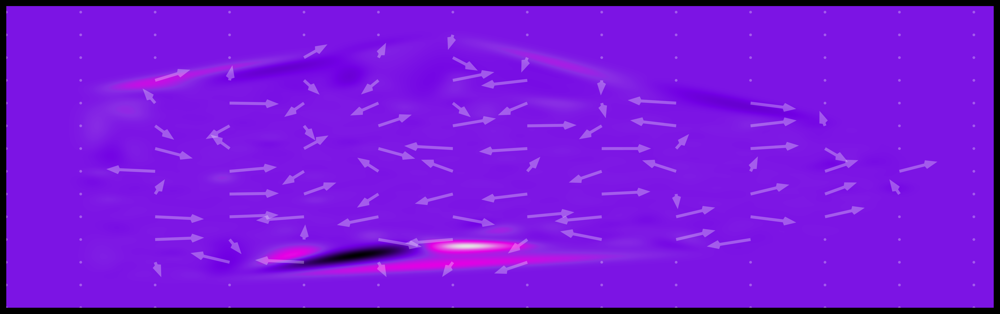
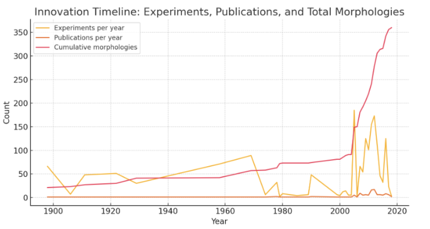

# Infinite Morphospace

This repository is a collection of Python scripts for simulating and visualizing concepts in morphogenesis and theoretical biology. The scripts explore reaction-diffusion systems, procedural shape generation, and classic models from the field.

## Analysis Tools

### [Ca²⁺ Wave Vector Analysis](./wave-vector-analysis/)

A complete pipeline for detecting and tracking Ca²⁺ signaling waves in time-lapse microscopy images of embryos. Processes multi-page TIFF images to detect bright spark events, track them across frames, segment embryos, and generate comprehensive analysis outputs. Includes visualization tools and supports 16-bit scientific imaging data.

**See [`wave-vector-analysis/README.md`](./wave-vector-analysis/README.md) for full documentation.**

#### Visualization Example

Flow field visualization showing spatial vector fields of Ca²⁺ wave propagation:

*Spatial vector field showing wave propagation directions and speeds. This visualization complements standard analysis tools by providing spatial flow patterns not available in direction distribution plots.*

### [Nanopublications](./nanopubs/)

Nanopublication-related files including wave files (.trig format), hypothesis mappings, and scripts for processing and canonicalizing nanopublications.

**See [`nanopubs/README.md`](./nanopubs/README.md) for details.**

## Scripts

*   [`planformDB_parser.py`](./planformDB_parser.py): Utilities to read a local PlanformDB SQLite/EDB file and extract yearly time series:
    - Experiments per year (via `Experiment → Publication.Year`)
    - Publications per year
    - Distinct morphologies observed per year (frequency > 0)
    Produces a merged, gap-filled `pandas.DataFrame` and a quick `matplotlib` plot. Set `DB_PATH` at the top of the script to your `.edb` file path and run the script to print summary rows and show the timeline.

The parser produces a timeline like this (experiments/year, publications/year, and cumulative morphologies):

*   [`thompson-1917.py`](./thompson-1917.py): A simple demonstration of D'Arcy Thompson's theory of transformations, showing how one shape can be deformed into another.
*   [`turing-morpho.py`](./turing-morpho.py): A simulation of the Gray-Scott reaction-diffusion model, which generates classic Turing patterns like spots and stripes.
*   [`raup.py`](./raup.py): Implements Raup's classic model of shell coiling, generating a variety of 3D shell forms.
*   [`Cervera–Levin–Mafe.py`](./Cervera–Levin–Mafe.py): A reaction-diffusion demo inspired by Cervera–Levin–Mafe (2021), exploring morphogen antagonism and its effect on pattern formation.
*   [`morpho-range.py`](./morpho-range.py): Generates a grid of abstract shapes by sweeping through a morphospace of reaction-diffusion parameters.
*   [`planarian-morphogen.py`](./planarian-morphogen.py): Simulates the generation of a planarian body shape, including eyes and pharynx, from underlying morphogen gradients. Can produce an animated GIF of the process.
*   [`levin-pkg.py`](./levin-pkg.py): An incomplete script intended to build an interactive knowledge graph of Michael Levin's work.
*   [`planformDB_parser.py`](./planformDB_parser.py): Parse and plot PlanformDB yearly statistics (set `DB_PATH` before running).
*   [`basic-plan.py`](./basic-plan.py): Quick static planarian silhouette generator with eyes.

### Turing Patterns (Preview)

