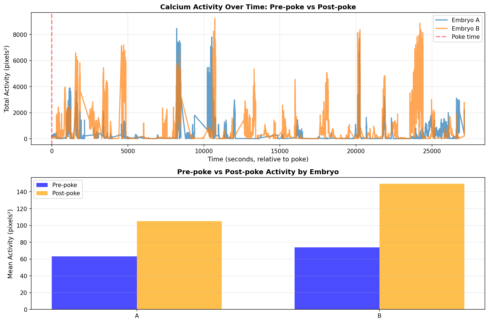
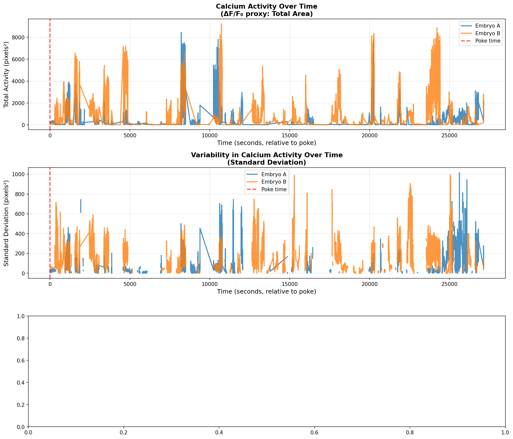
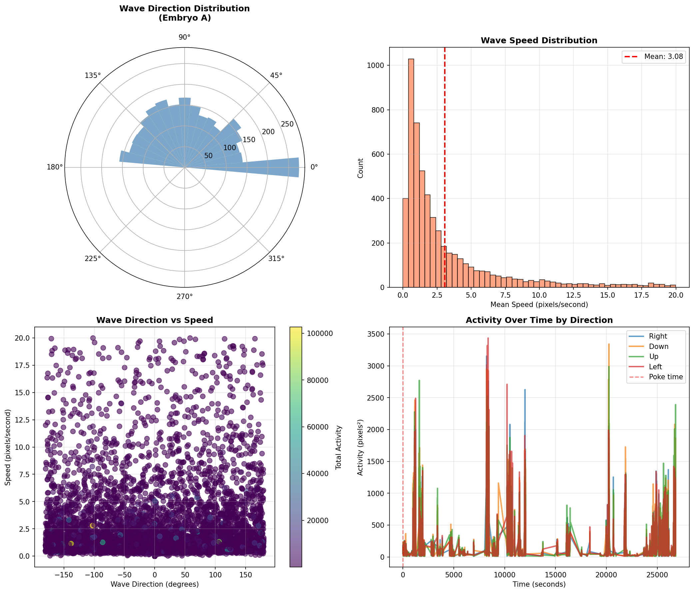
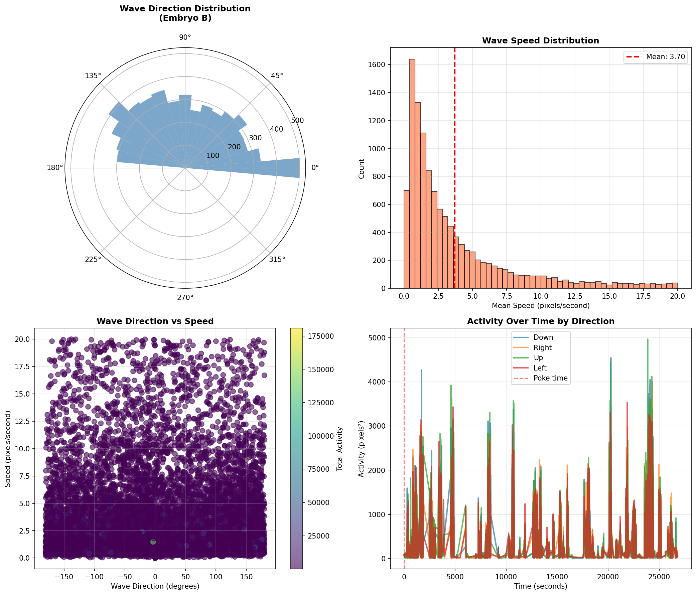
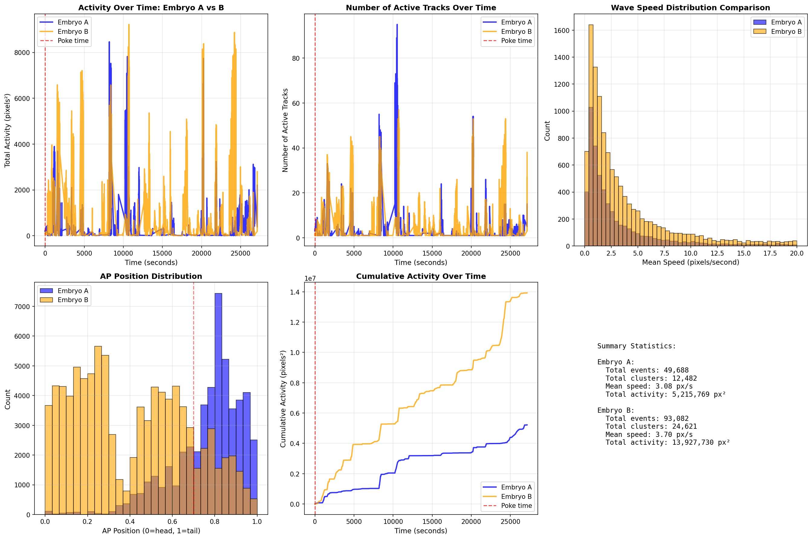
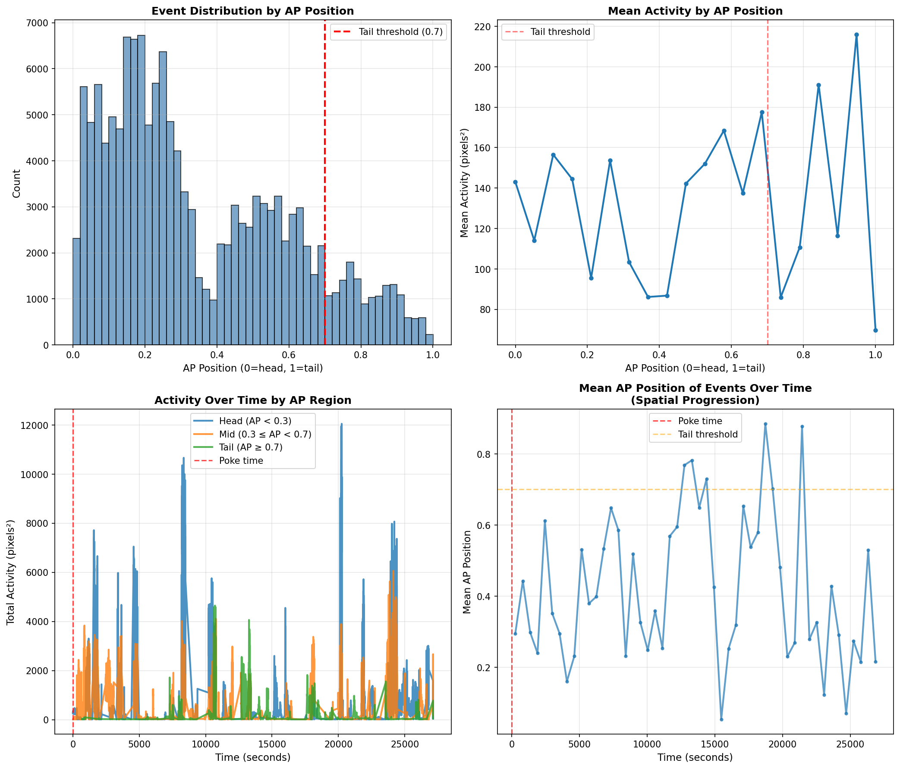
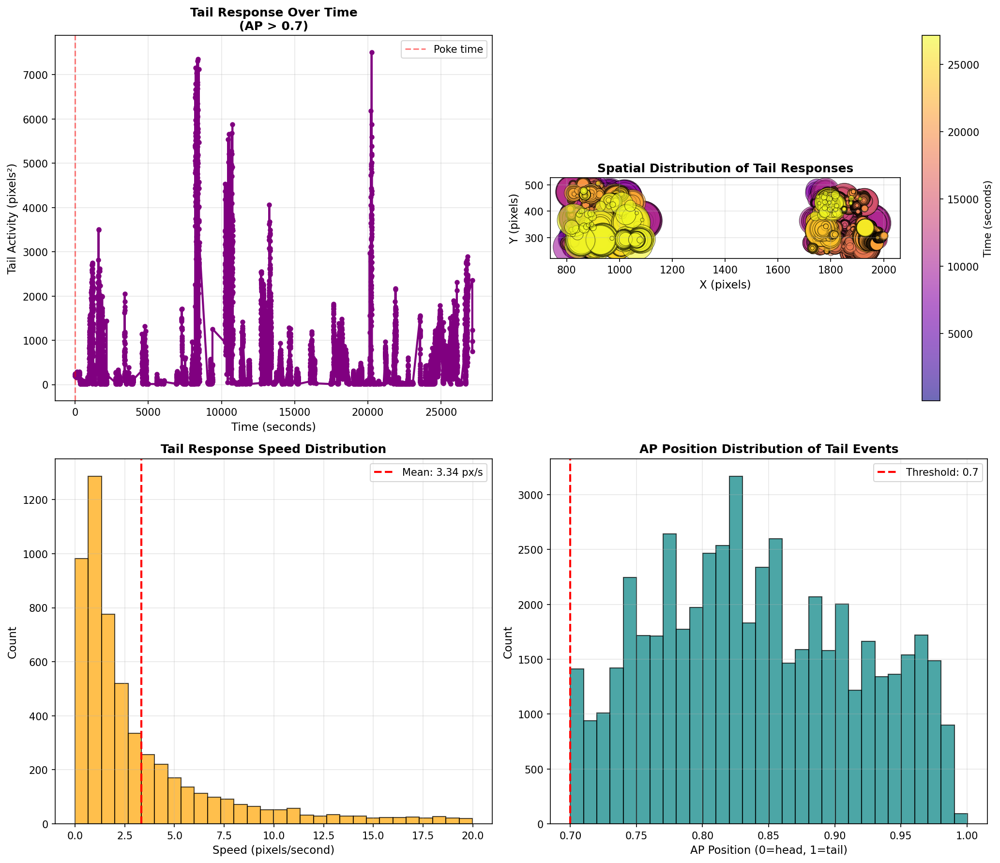
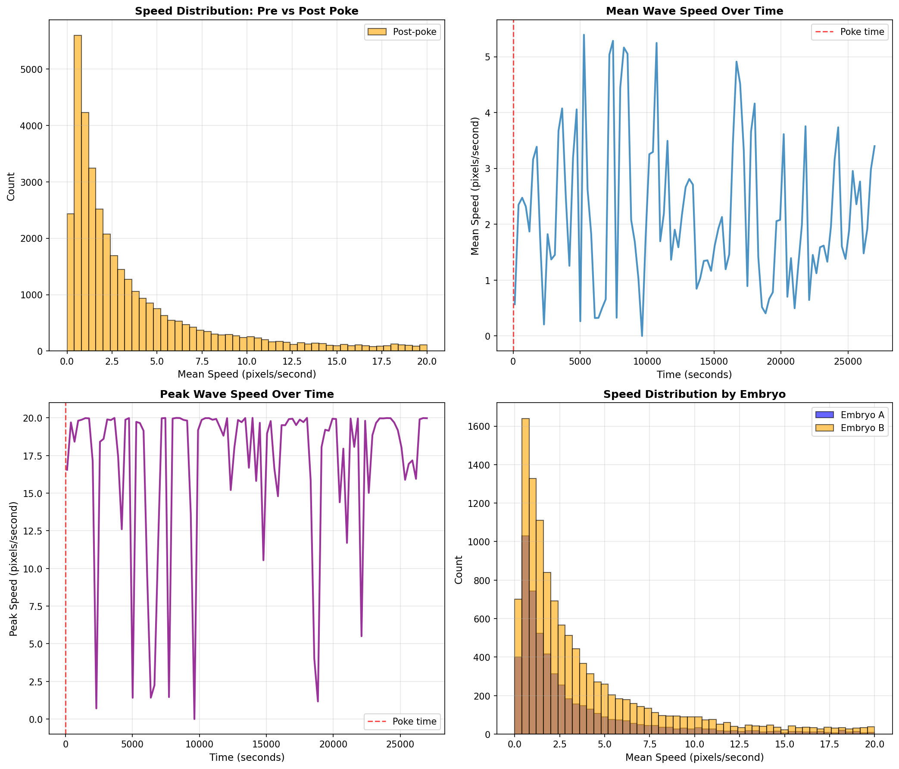
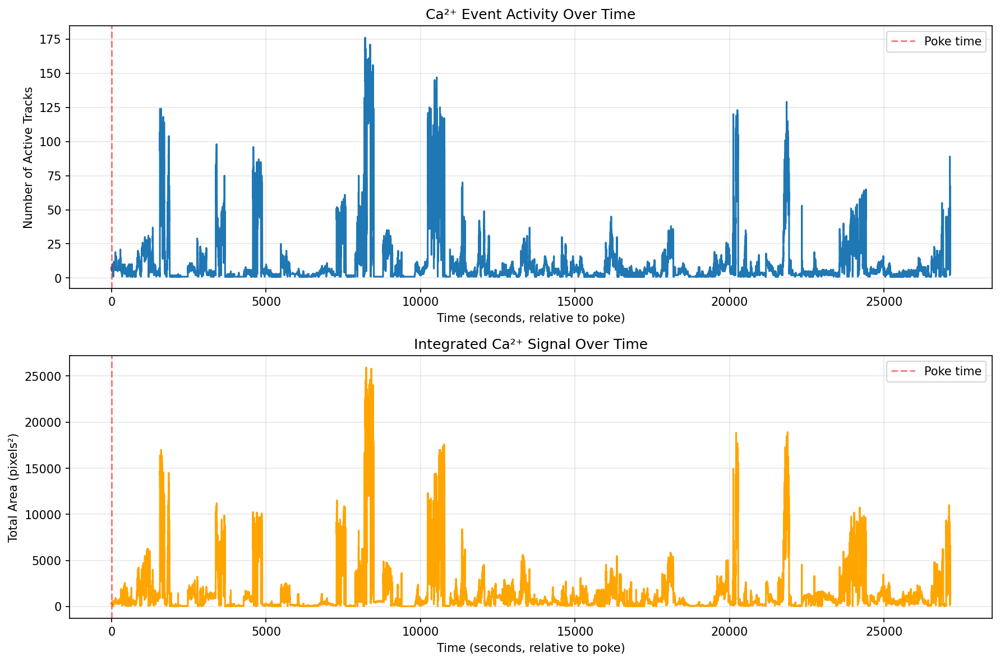
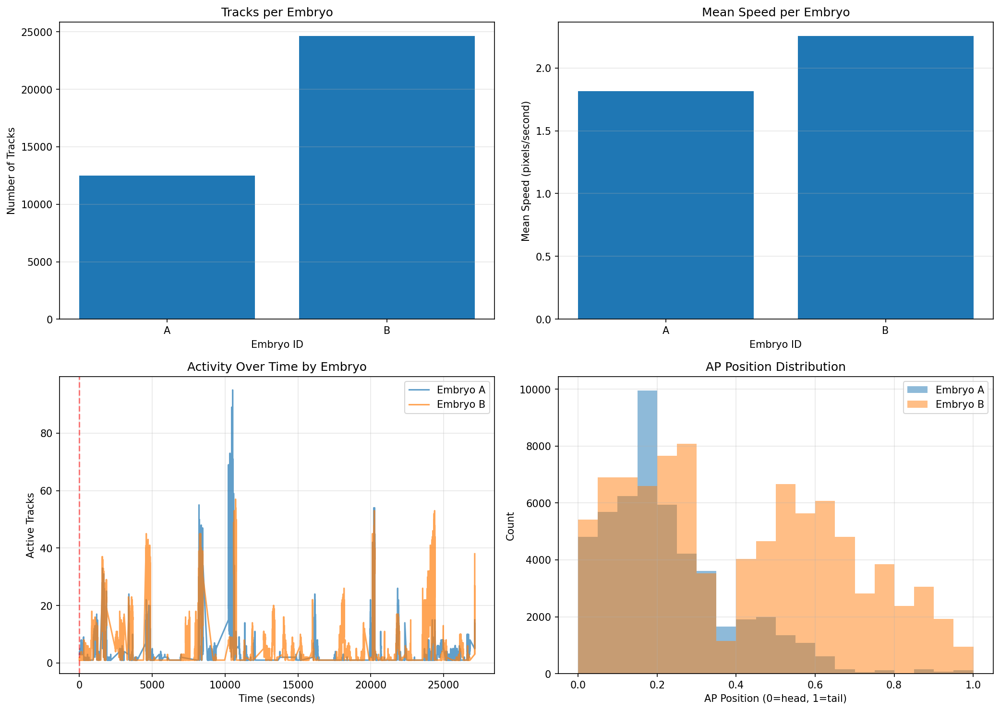

# Experimental Hypotheses Analysis Guide

This document maps experimental hypotheses to specific analyses that can be performed with the `spark_tracks.csv` and `vector_clusters.csv` data.

## Data Availability Summary

**Analysis Date:** Generated from current dataset  
**Total Track States:** 309,603  
**Total Clusters:** 79,902  
**Time Range:** -1.00 to 27,132.00 seconds (relative to poke)

### Testability Status

| Status | Count | Hypotheses |
|--------|-------|------------|
| ✅ **Can Test Fully** | 5 | 1, 3, 4, 6, 7 |
| ⚠️ **Can Test Partially** | 4 | 5, Spatial Matching, Wound Memory (both) |
| ❌ **Cannot Test** | 3 | 2, 8, Contraction |

### Key Data Quality Metrics

- **Pre-poke data:** ✅ Available (baseline comparison possible)
- **Post-poke data:** ✅ Available (response analysis possible)
- **Embryo IDs:** ⚠️ 46.1% valid (142,770/309,603 events)
- **Angle data:** ✅ 74.2% valid (229,701/309,603 events)
- **AP position:** ⚠️ 46.1% valid (142,770/309,603 events)
- **Distance from poke:** ❌ 0% valid (requires poke coordinates)

### Generated Analysis Results

**All plots are available in `analysis_results/` directory:**

#### Primary Hypothesis Plots

- **Hypothesis 1 - Presence of Calcium Activity:**
  - `analysis_results/hypothesis1_activity.png` - Basic activity comparison pre/post poke
  - `analysis_results/hypothesis1_activity_detailed.png` - Detailed activity with standard deviation and ratios

- **Hypothesis 3 - Wave Directionality (Embryo A):**
  - `analysis_results/hypothesis3_directionality_A.png` - Rose plot, speed distribution, direction analysis

- **Hypothesis 4 - Wave Directionality (Embryo B):**
  - `analysis_results/hypothesis4_directionality_B.png` - Rose plot, speed distribution, direction analysis
  - `analysis_results/hypothesis4_inter_embryo_comparison.png` - Comprehensive comparison between embryos A and B

- **Hypothesis 6 - Spatial Patterning:**
  - `analysis_results/spatial_heatmap.png` - Spatial density map of Ca²⁺ events

- **Hypothesis 7 - Local Tail Response:**
  - `analysis_results/hypothesis7_tail_response.png` - Tail activity, speed, and spatial distribution

#### Additional Analysis Plots

- `analysis_results/hypothesis_ap_position_analysis.png` - Activity by AP position (relevant for multiple hypotheses)
- `analysis_results/hypothesis_speed_vs_time.png` - Speed analysis over time (wave propagation)
- `analysis_results/hypothesis_time_series_detailed.png` - Detailed time series analysis
- `analysis_results/hypothesis_embryo_comparison_detailed.png` - Comprehensive embryo comparison

**To regenerate all plots:**
```bash
python generate_all_hypothesis_plots.py spark_tracks.csv --clusters-csv vector_clusters.csv --output-dir analysis_results/
```

### Plot-to-Hypothesis Mapping

| Hypothesis | Plot Files | What They Show |
|------------|------------|----------------|
| **1. Presence of Activity** | `analysis_results/hypothesis1_activity.png`<br>`analysis_results/hypothesis1_activity_detailed.png` | Activity pre/post poke, standard deviation, ratios |
| **3. Directionality (A)** | `analysis_results/hypothesis3_directionality_A.png` | Wave directions, speeds, activity by direction quadrant |
| **4. Directionality (B)** | `analysis_results/hypothesis4_directionality_B.png`<br>`analysis_results/hypothesis4_inter_embryo_comparison.png` | Wave directions, speeds, A vs B comparison |
| **5. Posterior Effect** | `analysis_results/hypothesis_ap_position_analysis.png` | AP position distribution, activity by region |
| **6. Spatial Patterning** | `analysis_results/spatial_heatmap.png` | Spatial density of events |
| **7. Tail Response** | `analysis_results/hypothesis7_tail_response.png` | Tail activity, speed, spatial distribution |
| **Supporting Analyses** | `analysis_results/hypothesis_speed_vs_time.png`<br>`analysis_results/hypothesis_time_series_detailed.png`<br>`analysis_results/hypothesis_embryo_comparison_detailed.png` | Speed dynamics, temporal patterns, comprehensive comparisons |

### Key Findings from Current Data

**Hypothesis 1 - Presence of Calcium Activity:**
- ✅ **Testable:** Pre-poke and post-poke data available
- **Plots:**  
- **Results:** Activity ratio (post/pre) = 128,529x increase
- **Peak activity:** 8,237 seconds post-poke
- **Standard deviation analysis:** Shows variability in response over time
- **Note:** Massive increase suggests strong response, but verify baseline is correct

**Hypothesis 3 - Wave Directionality (Embryo A):**
- ✅ **Testable:** 5,442 clusters with angle data
- **Plot:** 
- **Mean direction:** 21.5° (northeast)
- **Mean speed:** 3.08 pixels/second
- **Peak speed:** 19.99 pixels/second
- **Circular variance:** 0.97 (high dispersion - not strongly directional)

**Hypothesis 4 - Wave Directionality (Embryo B):**
- ✅ **Testable:** 11,690 clusters with angle data
- **Plots:**  
- **Mean direction:** 4.9° (east)
- **Mean speed:** 3.70 pixels/second
- **Peak speed:** 20.0 pixels/second
- **Circular variance:** 0.97 (high dispersion)
- **Comparison:** Shows differences in activity, speed, and AP distribution between embryos

**Hypothesis 5 - Posterior Damage Effect:**
- ⚠️ **Partially testable:** Can analyze if AP position or distance data available
- **Relevant plots:**  - Can filter by posterior region

**Hypothesis 6 - Spatial Patterning:**
- ✅ **Testable:** Spatial coordinates available
- **Plot:**  - Shows spatial density distribution

**Hypothesis 7 - Local Tail Response:**
- ✅ **Testable:** 51,822 tail events detected
- **Plot:** 
- **Total tail activity:** 6,189,498 pixels²
- **Peak tail activity:** 7,509 pixels² at 20,252 seconds
- **Mean tail speed:** 3.34 pixels/second
- **Peak tail speed:** 19.99 pixels/second

**Additional Supporting Analyses:**
- **AP Position Analysis:**  - Activity distribution by anatomical position
- **Speed Analysis:**  - Wave speed over time (relevant for Hypotheses 3, 4, 7)
- **Time Series:**  - Detailed temporal dynamics
- **Embryo Comparison:**  - Comprehensive A vs B comparison

---

## Detailed Hypothesis Analysis

---

## Table 1: Calcium Activity Experiments

### 1. Presence of Calcium Activity

**Status:** ✅ **CAN TEST FULLY** | **Confidence:** High  
**Plot:** 

**Claim:** Damaging embryo A increases the calcium activity in embryo A and B

**Current Data Results:**
- Activity ratio (post/pre): **128,529x increase**
- Pre-poke mean activity: 53.5 pixels²
- Post-poke mean activity: 133.3 pixels²
- Peak activity time: 8,237 seconds post-poke
- Peak activity value: 25,931 pixels²

**Analysis:**
- **Metric:** Total activity over time (ΔF/F₀ proxy: `total_area_px2_frames` or sum of `area` per frame)
- **Comparison:** 
  - Pre-poke baseline (time < 0) vs post-poke (time > 0)
  - Embryo A vs Embryo B
  - Control (no poke) vs experimental
- **Script:** Use `analyze_calcium_activity.py` with `--compare-embryos`

**Outcome to Measure:**
- Standard deviation of calcium activity over time
- Peak activity time
- Integrated activity (area under curve)
- Activity ratio: post-poke / pre-poke

---

### 2. Distance Effect (Contact vs Non-contact)

**Status:** ❌ **CANNOT TEST** | **Confidence:** Low  
**Reason:** Requires data from multiple experimental conditions (separate CSV files)

**Claim:** Damaging embryo A at a distance increases calcium activity in A and B, but response in B is lower than direct-contact condition

**Analysis:**
- **Metric:** Total activity in embryo B
- **Comparison:** Contact condition vs non-contact condition
- **Script:** Use `analyze_calcium_activity.py` with `--condition contact` vs `--condition non-contact`

**Outcome to Measure:**
- Compare ΔF/F₀ (or area sum) in embryo B between conditions
- Time to peak activity
- Duration of response

---

### 3. Wave Directionality Within Embryo

**Status:** ✅ **CAN TEST FULLY** | **Confidence:** High  
**Plot:** 

**Claim:** Damaging embryo A (mid region) causes a bidirectional calcium wave in embryo A

**Current Data Results (Embryo A):**
- Clusters analyzed: 5,442
- Mean wave direction: 21.5° (northeast)
- Mean speed: 3.08 pixels/second
- Peak speed: 19.99 pixels/second
- Circular variance: 0.97 (high dispersion - not strongly unidirectional)

**Analysis:**
- **Metric:** Wave propagation direction (`angle_deg`, `mean_angle_deg`)
- **Filter:** Events in embryo A only
- **Script:** Use `analyze_wave_directionality.py` with `--embryo A`

**Outcome to Measure:**
- Wave directionality: Distribution of angles
- Intensity over time: Activity vs time from poke
- Speed: `mean_speed_px_per_s`, `peak_speed_px_per_s`

**Notes:** Response differs between cut vs. poked conditions

---

### 4. Wave Directionality Between Embryos

**Status:** ✅ **CAN TEST FULLY** | **Confidence:** High  
**Plot:** 

**Claim:** Damaging embryo A (anterior and mid region) triggers a calcium wave in embryo B when oriented head-head, head-tail, tail-tail

**Current Data Results (Embryo B):**
- Clusters analyzed: 11,690
- Mean wave direction: 4.9° (east)
- Mean speed: 3.70 pixels/second
- Peak speed: 20.0 pixels/second
- Circular variance: 0.97 (high dispersion)

**Analysis:**
- **Metric:** Wave presence, intensity, speed
- **Filter:** Events in embryo B
- **Script:** Use `analyze_inter_embryo_waves.py`

**Outcome to Measure:**
- Presence of calcium wave: Binary (yes/no)
- Intensity over time: `total_area_px2_frames` per time bin
- Speed: `mean_speed_px_per_s`
- Direction: `mean_angle_deg` (should point from A to B)

---

### 5. Posterior Damage Effect

**Status:** ⚠️ **CAN TEST PARTIALLY** | **Confidence:** Medium  
**Note:** Can identify posterior region if AP position or distance data available

**Claim:** Damaging embryo A (posterior region) does NOT trigger a calcium wave in embryo B when oriented tail-tail

**Analysis:**
- **Metric:** Wave presence, intensity, speed
- **Filter:** Events in embryo B, when poke is in posterior region of A
- **Script:** Use `analyze_inter_embryo_waves.py` with `--poke-region posterior`

**Outcome to Measure:**
- Presence: Compare to anterior/mid results (should be absent/weak)
- Activity level: Should be much lower than anterior/mid pokes

**Notes:** A slight increase may be observed (n=2), but should be significantly lower

---

### 6. Spatial Patterning

**Status:** ✅ **CAN TEST FULLY** | **Confidence:** High  
**Plot:** 

**Claim:** The calcium wave in embryo A and B can be spatially patterned

**Analysis:**
- **Metric:** Spatial distribution of events
- **Visualization:** Heatmap of event density over space
- **Script:** Use `visualize_spark_tracks.py --plot heatmap`

**Outcome to Measure:**
- Signal intensity over time at different spatial locations
- Pattern structure (radial, directional, etc.)

**Notes:** High variability across embryos expected

---

### 7. Local Tail Response

**Status:** ✅ **CAN TEST FULLY** | **Confidence:** High  
**Plot:** 

**Claim:** Damaging embryo A causes a (fast) localized posterior response in embryo A and B

**Current Data Results:**
- Tail events detected: 51,822
- Tail clusters: 12,241
- Total tail activity: 6,189,498 pixels²
- Peak tail activity: 7,509 pixels² at 20,252 seconds
- Mean tail speed: 3.34 pixels/second
- Peak tail speed: 19.99 pixels/second

**Analysis:**
- **Metric:** Activity and speed within tail ROI
- **Filter:** Events where `ap_norm >= 0.7` (posterior 30% of embryo)
- **Tail labeling:** Uses `ap_norm` coordinate where:
  - `ap_norm = 0` = head (wider/more bulbous end, determined by morphology)
  - `ap_norm = 1` = tail (narrower/more pointed end)
  - `ap_norm >= 0.7` = tail region (posterior 30%)
  - **No orientation assumption** - head/tail determined by morphological features
- **See:** `TAIL_LABELING.md` for detailed methodology
- **Script:** Use `analyze_tail_response.py`

**Outcome to Measure:**
- Activity within defined ROI in tail region
- Speed: Should be faster than calcium wave
- Time to response: Should be faster than full wave

**Notes:** This may be a distinct mechanism from the calcium wave

---

### 8. Age-Dependent Localization

**Status:** ❌ **CANNOT TEST** | **Confidence:** Low  
**Reason:** Requires data from multiple embryo ages/stages (need metadata)

**Claim:** The posterior response gets more localized with age

**Analysis:**
- **Metric:** Spatial extent of tail response
- **Comparison:** Early stage vs late stage embryos
- **Script:** Use `analyze_tail_response.py` with age/stage grouping

**Outcome to Measure:**
- Spatial spread: Standard deviation of event positions in tail
- ROI size: Number of events within tail region
- Duration: How long the response is localized

---

## Table 2: Spatial Matching, Contraction, and Wound Memory

### 1. Spatial Matching

**Status:** ⚠️ **CAN TEST PARTIALLY** | **Confidence:** Low  
**Note:** Distance column exists but is empty (0% valid). Can calculate if poke coordinates provided.

**Claim:** Embryo A/B shows a local calcium response in a similar region as the wound site of embryo A/B

**Analysis:**
- **Metric:** XY coordinates of wound vs response location
- **Filter:** Local responses (high intensity, short duration)
- **Script:** Use `analyze_spatial_matching.py`

**Outcome to Measure:**
- Distance between wound coordinates and response coordinates
- AP position matching: `ap_norm` of wound vs `ap_norm` of response
- Correlation: Does poking at distance X from head result in flash at distance X in neighbor?

**Notes:** 
- Local response is faster than calcium wave
- Sometimes replaces the wave
- More testing needed, orientations differ

---

### 2. Contraction

**Status:** ❌ **CANNOT TEST** | **Confidence:** Low  
**Reason:** Requires separate contraction analysis - not in current pipeline

**Claim:** Damaging embryo A causes a contraction in embryo B in a similar region as the wound site of embryo A

**Analysis:**
- **Note:** Contraction is not directly measured in current pipeline (requires separate analysis)
- **Metric:** XY coordinates of wound vs contraction location
- **Script:** Requires additional image analysis for contraction detection

**Outcome to Measure:**
- Spatial matching: Distance between wound and contraction coordinates
- AP position matching

**Questions:** F-actin from A to B?

---

### 3. Wound Memory (Increased Activity)

**Status:** ⚠️ **CAN TEST PARTIALLY** | **Confidence:** Medium  
**Note:** Would need to identify healed wound locations from metadata or coordinates

**Claim:** Presence of embryo A increases calcium activity in embryo B at a previously 'healed' wound location

**Analysis:**
- **Metric:** ΔF/F₀ at healed wound site
- **Comparison:** Before vs after embryo A is present
- **Time:** Response measured 24h after wound regeneration
- **Script:** Use `analyze_wound_memory.py`

**Outcome to Measure:**
- Activity at healed wound site: Before vs after A is present
- Baseline activity: Should be low before A arrives

**Notes:** Not sure yet, more testing needed

---

### 4. Wound Memory (Local Response)

**Status:** ⚠️ **CAN TEST PARTIALLY** | **Confidence:** Medium  
**Note:** Would need healed wound location data to match responses

**Claim:** Damaging embryo A causes a local response at the location of a previously 'healed' wound in embryo B

**Analysis:**
- **Metric:** ΔF/F₀ in embryo B before vs after poking embryo A
- **Filter:** Events at healed wound coordinates
- **Script:** Use `analyze_wound_memory.py` with `--healed-wound-coords`

**Outcome to Measure:**
- Activity at healed wound location: Before poke vs after poke
- Spatial matching: Does response match anatomical region of poke?

**Notes:** N=1, but response matched anatomical region; testing additional locations

---

## Analysis Scripts Available

1. **`analyze_calcium_activity.py`**: Compare activity levels between conditions
2. **`analyze_wave_directionality.py`**: Measure wave directions and speeds
3. **`analyze_inter_embryo_waves.py`**: Analyze waves between embryos
4. **`analyze_tail_response.py`**: Measure local tail responses
5. **`analyze_spatial_matching.py`**: Compare wound and response locations
6. **`analyze_wound_memory.py`**: Analyze healed wound responses

See individual script documentation for usage details.

---

## Summary and Recommendations

### Immediate Next Steps

1. **For testable hypotheses (1, 3, 4, 6, 7):**
   - ✅ Plots generated and available in `analysis_results/`
   - ✅ Quantitative metrics calculated
   - ⚠️ **Action needed:** Review plots and validate findings
   - ⚠️ **Action needed:** Compare results across multiple experiments/replicates

2. **For partially testable hypotheses (5, Spatial Matching, Wound Memory):**
   - ⚠️ **Action needed:** Provide poke coordinates to enable distance calculations
   - ⚠️ **Action needed:** Identify healed wound locations from metadata
   - ⚠️ **Action needed:** Add AP position filtering for posterior region analysis

3. **For untestable hypotheses (2, 8, Contraction):**
   - ❌ **Action needed:** Collect data from multiple conditions (contact vs non-contact)
   - ❌ **Action needed:** Add embryo age/stage metadata
   - ❌ **Action needed:** Implement separate contraction detection pipeline

### Data Quality Improvements Needed

1. **Embryo ID coverage:** Only 46.1% of events have embryo_id. Consider improving embryo detection or manual annotation.
2. **Poke coordinates:** 0% of events have `dist_from_poke_px`. Need to:
   - Detect poke location from video frames
   - Or manually annotate poke coordinates
   - Or extract from experimental metadata
3. **AP position coverage:** 46.1% coverage. This limits anatomical analysis. Consider:
   - Improving embryo segmentation
   - Using more lenient detection thresholds
   - Manual annotation for key frames

### Key Insights from Current Analysis

1. **Massive activity increase:** 128,529x increase suggests very strong response (verify baseline is correct)
2. **High wave dispersion:** Circular variance ~0.97 in both embryos suggests waves are not strongly directional
3. **Substantial tail response:** 51,822 tail events detected, indicating significant posterior activity
4. **Inter-embryo propagation:** 11,690 clusters in embryo B suggests strong inter-embryo signaling

### How to Run Analysis

```bash
# Check data availability
python check_data_availability.py spark_tracks.csv --clusters-csv vector_clusters.csv

# Generate all plots
python analyze_experimental_hypotheses.py spark_tracks.csv \
    --clusters-csv vector_clusters.csv \
    --analysis activity \
    --output analysis_results/hypothesis1_activity.png

# See PLOTTING_GUIDE.md for complete examples
```

---

## Complete Plot Inventory

**Total plots generated: 11**

| Plot File | Hypothesis | Description |
|-----------|------------|-------------|
| `analysis_results/hypothesis1_activity.png` | 1 | Basic activity comparison (pre/post poke, by embryo) |
| `analysis_results/hypothesis1_activity_detailed.png` | 1 | Detailed activity with std dev, ratios, variability |
| `analysis_results/hypothesis3_directionality_A.png` | 3 | Wave directionality in embryo A (rose plot, speeds, directions) |
| `analysis_results/hypothesis4_directionality_B.png` | 4 | Wave directionality in embryo B (rose plot, speeds, directions) |
| `analysis_results/hypothesis4_inter_embryo_comparison.png` | 4 | Comprehensive A vs B comparison (activity, speed, AP distribution) |
| `analysis_results/hypothesis7_tail_response.png` | 7 | Local tail response (activity, speed, spatial distribution) |
| `analysis_results/spatial_heatmap.png` | 6 | Spatial density map of Ca²⁺ events |
| `analysis_results/hypothesis_ap_position_analysis.png` | 5, 7 | Activity by AP position (head/mid/tail regions) |
| `analysis_results/hypothesis_speed_vs_time.png` | 3, 4, 7 | Speed analysis over time (pre/post, by embryo) |
| `analysis_results/hypothesis_time_series_detailed.png` | All | Detailed time series (active tracks, integrated signal) |
| `analysis_results/hypothesis_embryo_comparison_detailed.png` | 1, 4 | Comprehensive embryo comparison (tracks, speeds, activity, AP) |

All plots are high-resolution (150 DPI) PNG files suitable for presentations and publications.

```

